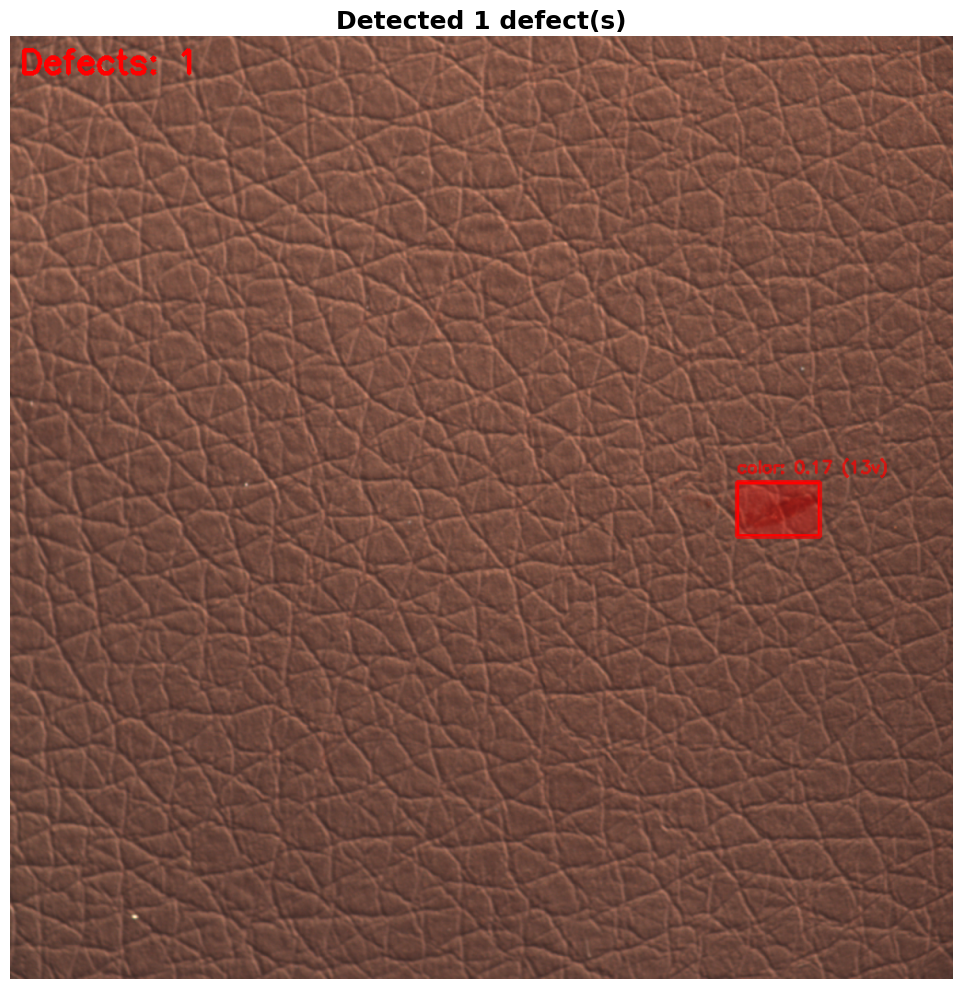
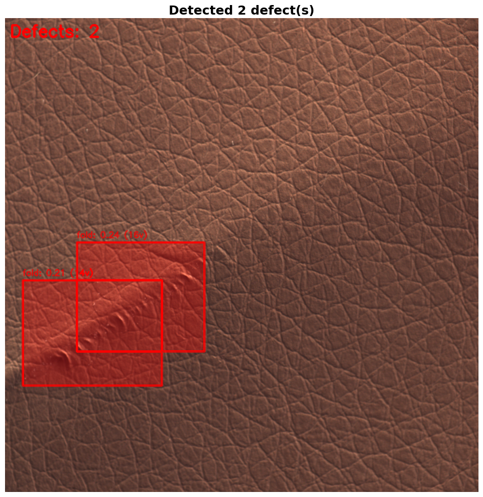
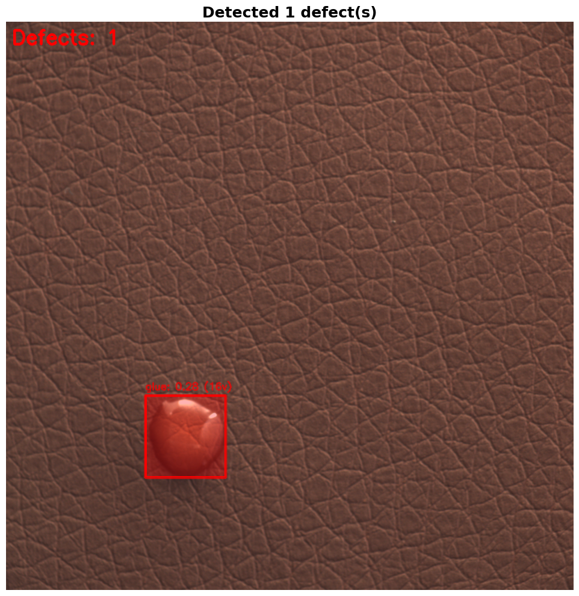
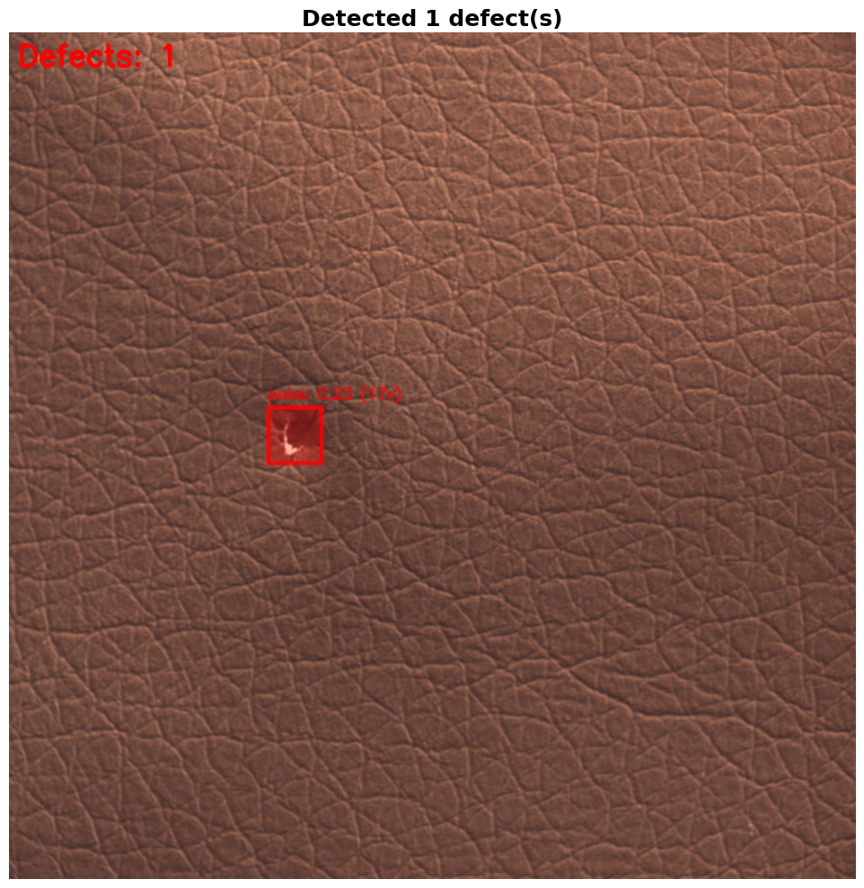

# YOLO + Qdrant Leather Defect Detection Pipeline

A complete AI-powered defect detection system for leather quality inspection using YOLO object detection and Qdrant vector search for defect classification.

## Overview

This project implements an end-to-end pipeline for detecting and classifying defects in leather products:

1. **YOLO Detection**: Detects leather surfaces and defect regions using YOLOv8
2. **Qdrant Classification**: Classifies defect types using image-to-image similarity search with CLIP embeddings
3. **Real-time Processing**: Optimized for production deployment with TensorRT

## Defect Types Detected

- **Color**: Color variations and discoloration stains
- **Cut**: Cuts, tears, and slashes in leather
- **Fold**: Folds, creases, and wrinkles
- **Glue**: Glue residue and adhesive marks
- **Poke**: Holes and punctures

## Architecture

```
Input Image
    ↓
YOLO Detection (YOLOv8n)
    ↓
Defect Crop Extraction
    ↓
CLIP Image Embedding
    ↓
Qdrant Vector Search
    ↓
Defect Classification
```


## Installation

### 1. Clone the Repository
```bash
git clone https://github.com/Vanshgarg-dev/yolo-qdrant-defect-classification/blob/main/yolo_qdrant_defect_detection.ipynb
cd defect_detection
```

### 2. Create Virtual Environment
```bash
python -m venv .venv
source .venv/bin/activate  # On Windows: .venv\Scripts\activate
```

### 3. Install Dependencies
```bash
pip install ultralytics opencv-python pillow torch torchvision tqdm
pip install fastembed qdrant-edge-py
```

### 4. Download MVTec Leather Dataset
```bash
Download from: https://www.mvtec.com/company/research/datasets/mvtec-ad
Extract to: mvtec_anomaly_detection/leather/
```

## Dataset Structure

```
mvtec_anomaly_detection/leather/
├── train/
│   └── good/              # Good leather samples (no defects)
├── test/
│   ├── color/             # Color defect samples
│   ├── cut/               # Cut defect samples
│   ├── fold/              # Fold defect samples
│   ├── glue/              # Glue defect samples
│   └── poke/              # Poke defect samples
└── ground_truth/
    ├── color/             # Defect masks
    ├── cut/
    ├── fold/
    ├── glue/
    └── poke/
```


### Classification Accuracy
- Uses image-to-image similarity with CLIP embeddings
- Top-K nearest neighbor voting (K=15)
- Confidence scoring: 70% similarity + 30% vote ratio


## Project Structure

```
defect_detection/
├── yolo_qdrant_defect_detection.ipynb  # Main notebook
├── mvtec_anomaly_detection/            # Dataset
├── yolo_leather_dataset/               # YOLO format dataset
├── qdrant-edge-directory/              # Vector database
│   ├── models/                         # CLIP models
│   └── shard/                          # Embeddings
├── runs/                               # Training outputs
│   └── detect/
│       └── leather_defect_seg/
│           └── weights/
│               └── best.pt             # Trained model
└── README.md
```

## Technical Details

### YOLO Configuration
- **Model**: YOLOv8n (nano)
- **Input Size**: 640x640
- **Classes**: 2 (leather, defect)
- **Augmentation**: HSV, rotation, translation, scaling, flipping, mosaic

### Qdrant Configuration
- **Embedding Model**: CLIP ViT-B/32
- **Vector Dimension**: 512
- **Distance Metric**: Cosine similarity
- **Database**: Qdrant Edge (local, no server required)

### Classification Pipeline
1. Extract defect crop from YOLO detection
2. Generate CLIP embedding
3. Query Qdrant for top-15 nearest neighbors
4. Vote-based classification with confidence scoring

## Outputs




## Troubleshooting

### GPU Memory Issues
```python
# Reduce batch size
batch=4  # instead of 8

# Use smaller image size
imgsz=416  # instead of 640
```

### Low Detection Accuracy
```python
# Lower confidence threshold
conf_threshold=0.10  # instead of 0.15

# Adjust IOU threshold
iou_threshold=0.5  # instead of 0.7
```

### Classification Errors
```python
# Increase top-K neighbors
top_k=20  # instead of 15

# Add more training samples to Qdrant database
```
### In collaboration with [Superteams.ai](https://www.superteams.ai/)
